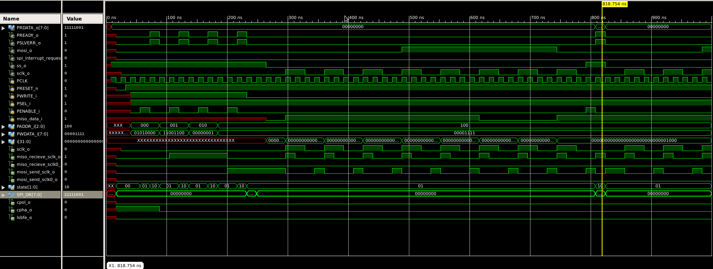
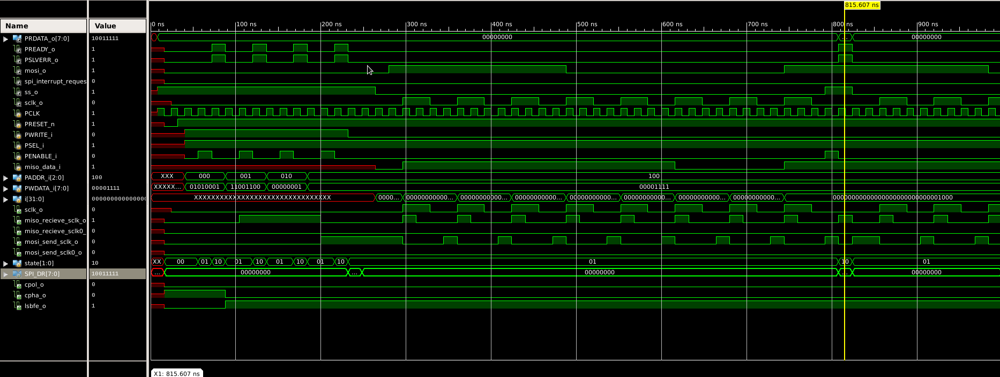
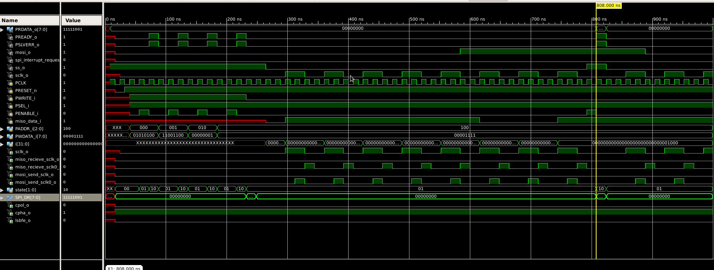
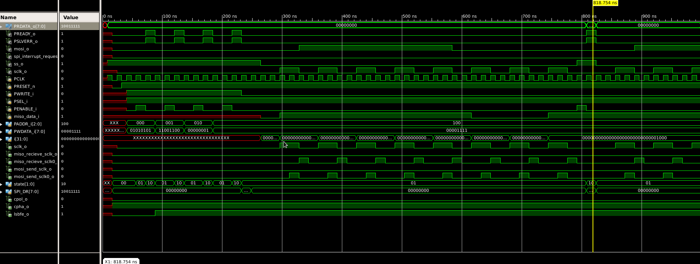
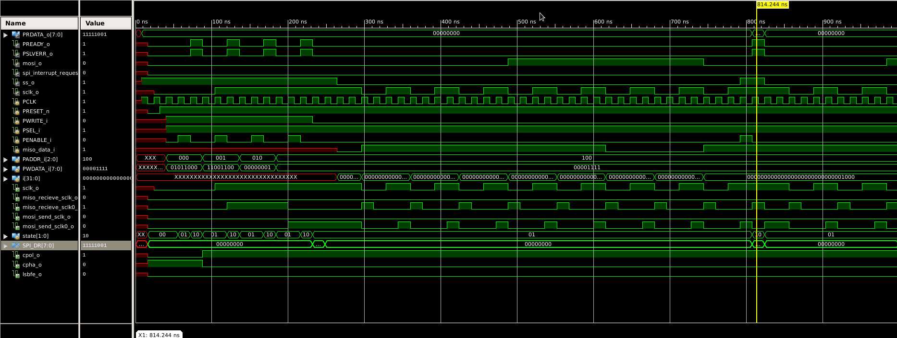
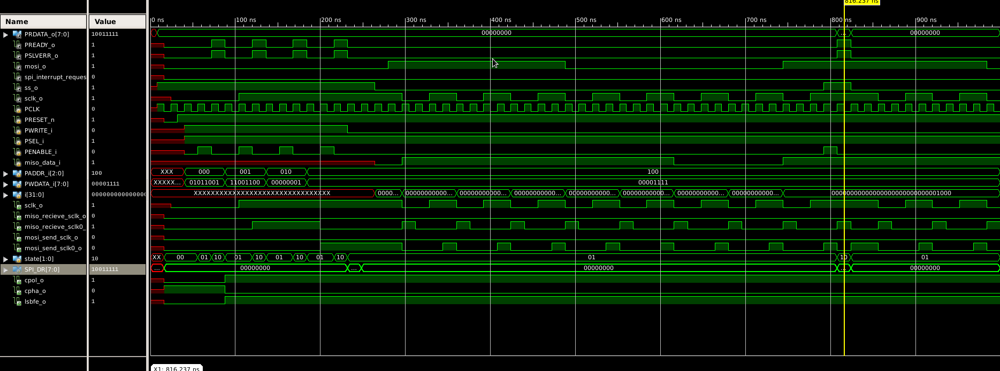
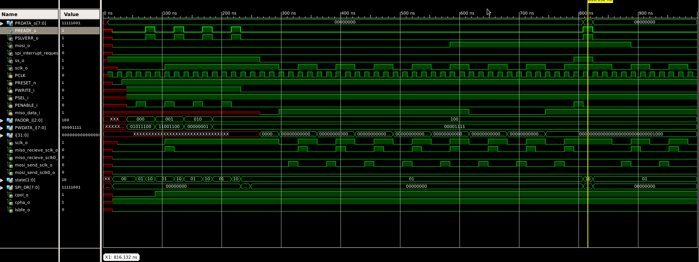
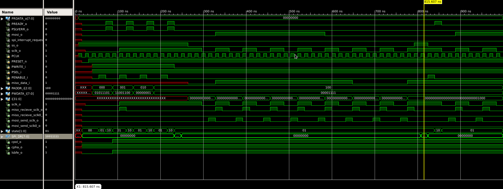

## Simulation – APB-SPI Core

This folder contains the **simulation setup** for the APB-SPI Core.  
Simulation validates the RTL design using a **top-level testbench (`top_tb.v`)** and ensures correct SPI protocol behavior across all configurations.

---

##  Purpose of Simulation

- Verify **APB bus transactions** (register read/write).  
- Validate **SPI protocol signals**: SCLK, MOSI, MISO, SS.  
- Test all four SPI modes (**CPOL/CPHA combinations**).  
- Confirm correct operation of **MSB-first** and **LSB-first** transfers (LSBFE bit in SPICR1).  
- Produce waveform screenshots for documentation.  

---

##  Tools Used

- **Xilinx ISE / ISim** (graphical simulation flow).   

---

##  How to Run (ISE / ISim)

1. **Open Xilinx ISE Project Navigator.**  
   - Create or open an existing project.  
   - Add RTL files from `../rtl/`.  
   - Add `top_tb.v` from this folder.  

2. **Set Testbench as Top.**  
   - Right-click `top_tb.v` → *Set as Top Module*.  

3. **Launch Simulation.**  
   - Right-click → *Simulate Behavioral Model*.  
   - ISim compiles sources automatically.  

4. **Add Signals to Waveform.**  
   - Expand DUT hierarchy and add: `SCLK`, `MOSI`, `MISO`, `SS`, TIP/SPIF flags.  

5. **Run Simulation.**  
   - Let the testbench iterate through modes.  
   - Zoom into one SPI transfer per mode.  

6. **Export Waveforms.**  
   - Use ISim *Export Waveform* or OS screenshot tools.  
   - Save images under `sim/waveforms/` with proper filenames.  

---

##  Testbench Details (`top_tb.v`)

- Programs **SPICR1** via APB writes:  
  - `CPOL` → controls SCLK idle polarity.  
  - `CPHA` → controls sampling edge.  
  - `LSBFE` → controls bit order (0 = MSB-first, 1 = LSB-first).  

- Iterates automatically through:  
  - **Mode 0 (CPOL=0, CPHA=0)**  
  - **Mode 1 (CPOL=0, CPHA=1)**  
  - **Mode 2 (CPOL=1, CPHA=0)**  
  - **Mode 3 (CPOL=1, CPHA=1)**  

- For each mode:  
  - Runs once with MSB-first.  
  - Runs once with LSB-first.  

- Performs APB writes to **SPICR1** and **SPI_DR**, waits for transfer completion, then logs results.  

---

##  Waveform Gallery

Eight screenshots should be saved under `sim/waveforms/`:

### Mode 0 (CPOL=0, CPHA=0)
- MSB-first  
    
- LSB-first  
    

### Mode 1 (CPOL=0, CPHA=1)
- MSB-first  
    
- LSB-first  
    

### Mode 2 (CPOL=1, CPHA=0)
- MSB-first  
    
- LSB-first  
    

### Mode 3 (CPOL=1, CPHA=1)
- MSB-first  
    
- LSB-first  
    

---

##  Summary

- The simulation confirms the SPI core works for **all CPOL/CPHA modes**.  
- Both **MSB-first** and **LSB-first** data ordering are validated.  
- Waveforms demonstrate correct SCLK polarity, sampling phase, and bit ordering.  
- This ensures the design is **functionally correct** before coverage   
```
